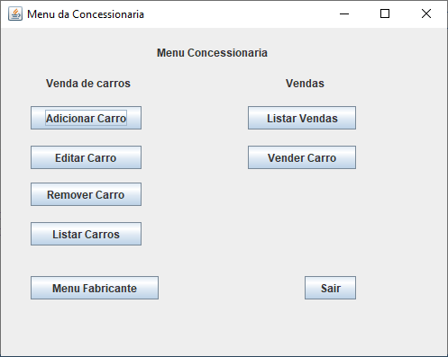
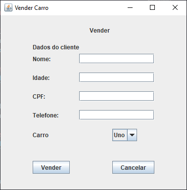
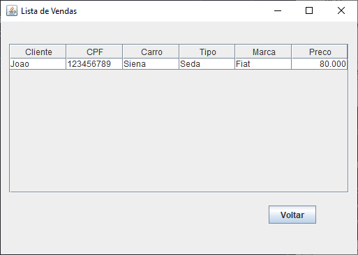

# Sistema-Concessionaria

Sistema CRUD de uma Concessionaria e Fabricante de carros onde é possivel vender um carro a um cliente cadastrado no sistema.

* [Diagramas](#Diagramas)
* [Desing Pattern](#Desing-Pattern)
* [Menus](#menus)
* [Tratamento de erros](#Tratamento-de-erros)
* [Polimorfismo](#Polimorfismo)

# Diagramas

### Diagrama de classes


# Desing Pattern

No sistema foram implementados dois Desing Pattern, o primeiro deles foi o ```Singleton``` para garantir que uma unica instancia das classes de Menus seja instanciada.


O segundo é o ```Delegação``` que nada mais é do que polimorfismo implementado no sistema, onde uma subclasse do Carro é tratado como um objeto da superclasse.

O terceiro Desing Pattern usado no sistema foi o ```Visitor``` para filtrar a lista de carros das classes.


# Menus

## Login
A primeira janela do sistema é uma janela de Login, o usuario e senha são definidos dentro do código do sistema na classe Login


Após fazer o login o menu da Concessionaria irá abrir com diversas opções porém é necessário adicionar carros na Fabricante de carros antes de começar as operações na Concessionaria pois se não alguns warnings irão aparecer.



## Menu Fabricante

Clicando na opção menu da fabricante o usuário sera redirecionado ao menu da propria


A fabricante possui os metódos CRUD padrões e os warnings de editar e remover da concessionaria se aplicam a ela também.

### Adicionar carro:


### Listar carro:


### Remover carro:


### Editar carro:


___
Em todos os metódos de editar e inserir há uma verificação para os valores númericos e valores vazios


## Menu da Concessionaria


Voltando ao menu da concessionaria, os warnings mencionados anteriormente seriam estes:

Caso o usuário queira editar, remover ou vender um carro que não esteja na lista de carros a venda pela concessionaria


Para a opção ```Adicionar Carro```, se caso a Fabricante não possuir nenhum carro fabricado disponível


Como agora temos carros fabricados podemos prosseguir. Os metodos CRUD da concessionaria são os mesmos da Fabricante porém com algumas diferenças como por exemplo no de adicionar


A concessionaria só possui a opção de mudar o preço de um carro para sua venda, este preço deve ser maior que o sugerido pela fabricante, caso não seja uma mensagem de erro aparecerá


Remover e listar se mantem iguais aos da Fabricante mas apenas com carros da lista de à venda. No metódo editar só é possivel alterar o preço do carro à venda.

### Vender Carro

Na opção ```Vender Carro``` o usuário deve preencher os dados do cliente que irá comprar o veiculo e qual carro que irá vender, ao clicar em ```Vender``` o carro é removido da lista de disponiveis para a venda e uma "nota fiscal" é criada com os dados de ambos. O mesmo tratamento para valores nulos e negativos é feito no cadastro do cliente.




### Listar vendas

Apresenta uma lista das notas fiscais



# Tratamento de Erros

Um exemplo de tratamento de erro usando try catch já foi mostrado acima com o metodo vender e inserções com valores vazios e negativos. Todos os metodos de adicionar, remover e editar possuem try catch para prevenir possiveis erros, exemplo de tratamento usando exceção personalizada:


# Polimorfismo

Polimorfismo no sistema é feito pela classe Carro, temos uma interface ```ICarro``` com metodos genericos, a classe Carro implementa esses metodos, as classes ```CarroHatch``` e ```CarroSeda``` são um Carro, ou seja, elas herdam os metodos de carro.

As listas de Carros da Fabricante e Carros da Concessionaria são do tipo Carro e recebem objetos do tipo CarroHatch e CarroSeda


